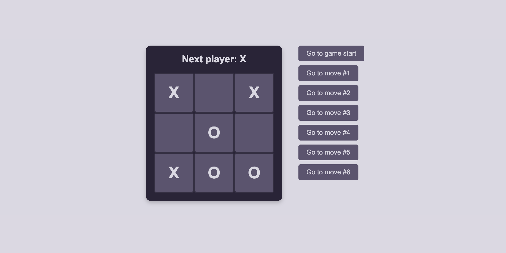

# Tic-Tac-Toe Game

This is a React-based Tic-Tac-Toe game developed as a learning project. The project follows the [React documentation tutorial) and is intended to improve my understanding of React fundamentals.

## Features
- Classic Tic-Tac-Toe game mechanics.
- Interactive and responsive UI.
- Players alternate turns to place "X" or "O" on the game board.
- Ability to restart the game and jump to specific game states (move history).

## Website link - 

## Screenshot

